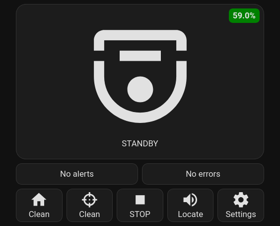
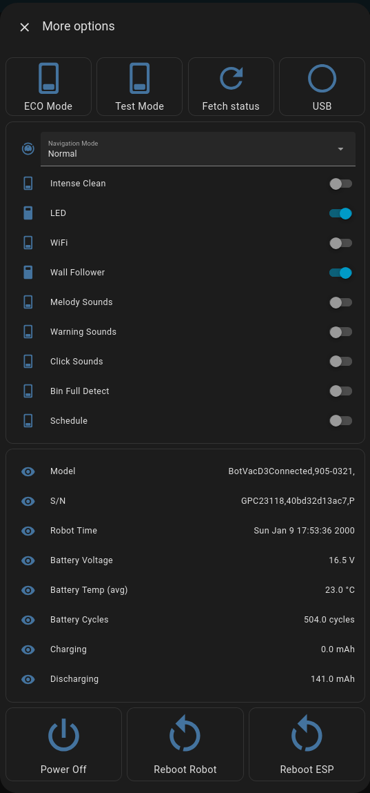
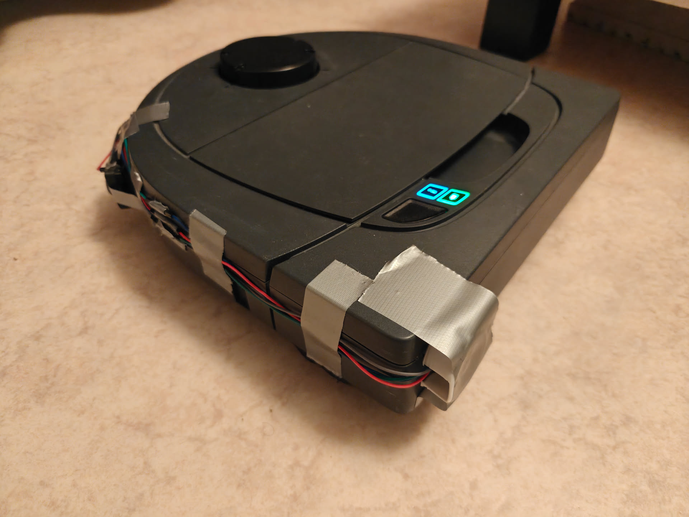
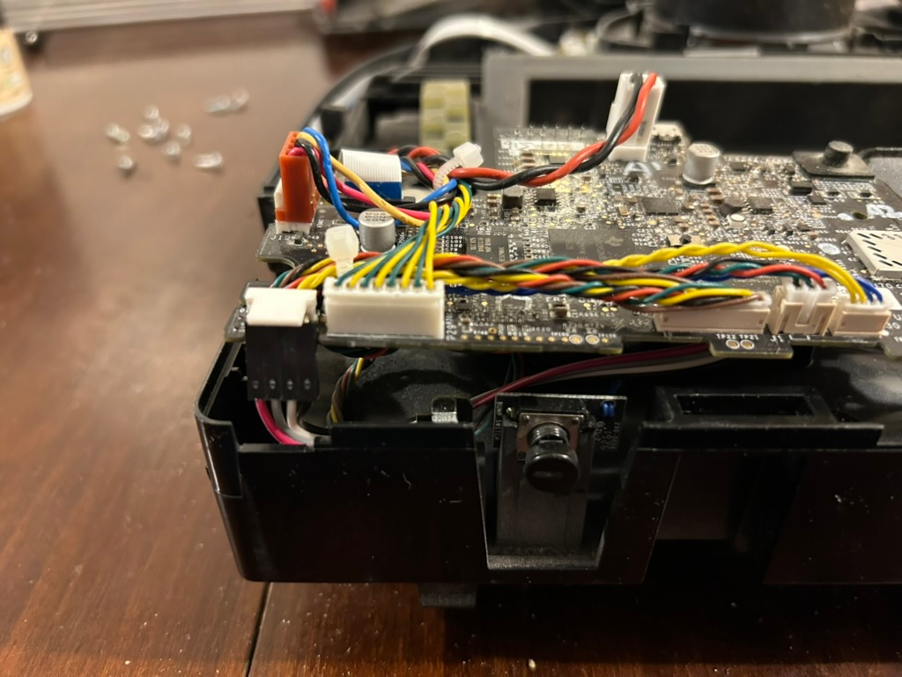
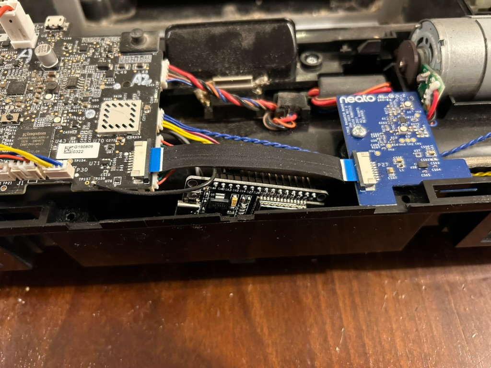

# neato-connected

# WARNING - this branch is for work in progress text! please go to the main branch!

### What is this?

Repair your Neato Robot Vacuum to be controlled via home assistant after the shutdown of the Neato servers. The scope of this project is to give your robot at least the same functionallity as when you bought it, however as the project is in a development state, the current functionalities include:
- Viewing status
- Start & stop cleaning
- Editing settings (even some hidden settings!)
- Scheduling via an home assistant automation/script

The ability to create, view and edit floormaps so the robot can get the same functionallity with nogo-lines and zones is in the making.

Main card | Settings View
:-------------------------:|:-------------------------:
 |  

**I would like to support all robots where an debug interface, or other controls, is accessible, but since I only have a D3, I can only test on that one. If you have another robot, please open an discussion so we can verify that it works or add support for it!**

As far as I know, only the D3, D4, D5, D7 and D7 has the firmware `4.5.3` and currenly the config is based on that so the robots that should work with that firmware is as follows:
- Confirmed working: **D3, D5, D7**
- Should work, need confirmation: **D4, D6** 

If you have another Neato robot, please open an issue here on github so we can add support for it, however we might need your help to know what needs to change!

**Trickier robots**
- D8 (probably D9, D10) - These robots use a compleatly different board, chip and firmware, and because the debug interface seams to be behind a password lock, this cannot be controlled directly.

#### How-to connect
Sadly to be able to repair your neato vacuum you **need to access an USB port or debug pins** to be able to connect to the debug interface. The current methods are:

Drill a hole in the bumper to access the debug port | Open the robot and bend pins or solder to debug connector
:-------------------------:|:-------------------------:
  |   

I understand these methods are hard or destructive, I am currently investigating the possibility of accessing the debug interface using less extreme methods, however so far I have come up empty handed.

### Getting started!

First of all you should start thinking about how you want to keep your robot connected, but if you don't want to commit to opening or drilling an hole in the bumper yet, you can always take the bumper off and connect an esp device to the robot and just run it via Home Assistant. If you don't have an Home Assistant installation you can try to control it via the [web server interface](./ha-images.md#webserver-interface).

TODO:
1. setup hacs
    1. esphome
    2. browser-mod
    3. button-card
2. Esphome config, build for your device
    - set keys correctly, etc
3. Ha card, set entityid to the same
4. DONE, control your vacuum via HA!

### Acknowledgements

- @Fabian Ullrich, Jiska Classen, Johannes Eger and Matthias Hollick from Secure Mobile Networking Lab
    - [Security and Privacy for IoT Ecosystems](https://tuprints.ulb.tu-darmstadt.de/handle/tuda/4937)
    - [Vacuums in the Cloud:
Analyzing Security in a Hardened IoT Ecosystem](https://www.usenix.org/system/files/woot19-paper_ullrich.pdf)
    - And all of their work on these robots, including talks etc!
- [@jeroenterheerdt](https://github.com/jeroenterheerdt) for testing, reviewing and the original [neato-serial](https://github.com/jeroenterheerdt/neato-serial)
- [@algaen](https://github.com/algaen) for the info about the D8 (D9, D10?) robots
- [@tomwj](https://github.com/tomwj) for testing and pictures installing it internally in a D7

